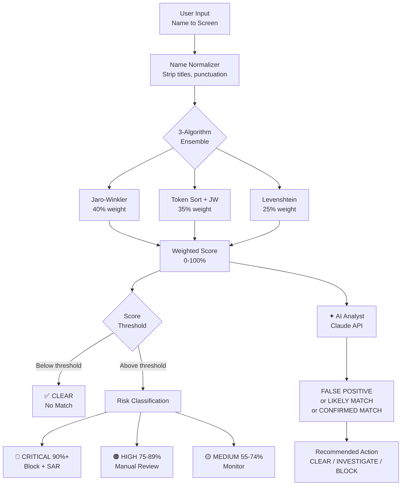

```mermaid
flowchart TD
    A[User Input\nName to Screen] --> B[Name Normalizer\nStrip titles, punctuation]
    B --> C{3-Algorithm\nEnsemble}
    C --> D[Jaro-Winkler\n40% weight]
    C --> E[Token Sort + JW\n35% weight]
    C --> F[Levenshtein\n25% weight]
    D --> G[Weighted Score\n0-100%]
    E --> G
    F --> G
    G --> H{Score\nThreshold}
    H -->|Below threshold| I[✅ CLEAR\nNo Match]
    H -->|Above threshold| J[Risk Classification]
    J --> K[🔴 CRITICAL 90%+\nBlock + SAR]
    J --> L[🟠 HIGH 75-89%\nManual Review]
    J --> M[🟡 MEDIUM 55-74%\nMonitor]
    G --> N[✦ AI Analyst\nClaude API]
    N --> O[FALSE POSITIVE\nor LIKELY MATCH\nor CONFIRMED MATCH]
    O --> P[Recommended Action\nCLEAR / INVESTIGATE / BLOCK]
```
